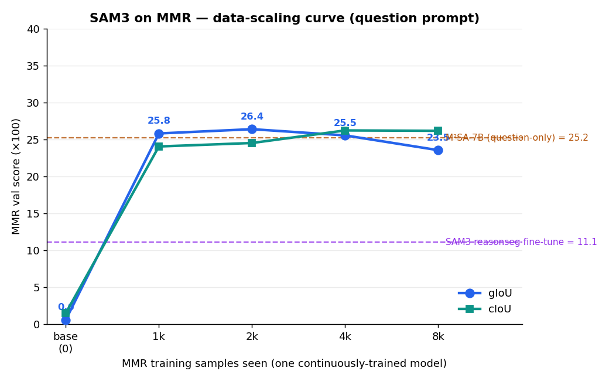

# SAM3 on MMR — data-scaling curve

**Question:** if we train a *fresh* SAM3 on MMR training samples, how does MMR-val performance
scale with the number of samples? One model, trained **continuously** through 4 chained stages
(each continues the previous stage's weights on *new* data, 1 epoch, batch 1, your
`sam3-reasonseg-mixed` recipe), benchmarked on MMR val (question prompt, union gIoU/cIoU) after each.

## Results (MMR val, question prompt)

| cumulative samples | gIoU | cIoU | IoU@50 |
|--:|--:|--:|--:|
| 0 (base SAM3) | 0.6 | 1.5 | 0.6 |
| **1,000** | **25.8** | 24.0 | 25.5 |
| **2,000** | **26.4** ← peak | 24.5 | 24.4 |
| **4,000** | 25.5 | 26.2 | 25.1 |
| **8,000** | 23.5 | 26.2 | 23.1 |

Reference (same benchmark): base SAM3 **0.6**, your reasonseg fine-tune **11.1**,
M²SA-7B question-only **25.2**, M²SA-7B official (teacher-forced) **36.0**.

Per-granularity gIoU (obj / part / obj&part) and single/multi-target are in `../mmr_eval/mmr_stage{1..4}.json`.

## Findings

1. **Almost all the gain comes from the first ~1,000 samples** (0.6 → 25.8 gIoU, ~40×). With just
   1–2k MMR samples a fresh SAM3 **matches M²SA-7B's question-only score (25.2)** and far exceeds
   both base SAM3 (0.6) and the reasonseg referring-expression fine-tune (11.1).
2. **gIoU plateaus then slightly declines** (peak 26.4 at 2k → 23.5 at 8k), while **cIoU keeps
   creeping up** (24.0 → 26.2). More data tightens big-mask overlap (cIoU, area-weighted) but the
   average-sample score (gIoU) stops improving and drifts down.
3. **This confirms the earlier diagnosis:** SAM3's failure on MMR was *lack of reasoning-style
   training data*, not the architecture. A little in-distribution data closes almost the entire gap
   to the purpose-built LLM model.

## Important caveat on the plateau/decline
The regime is **incremental, single-epoch, fresh-optimizer-per-stage**: each stage sees only its new
chunk and restarts the LR warmup. The 8k dip likely reflects mild drift/forgetting from that design
(the last stage fine-tunes hard on 4k *new* samples with a fresh schedule, never revisiting earlier
data) rather than a true "more data hurts." A cumulative-data pass or a single continuous LR schedule
over all 8k would likely hold or modestly improve the peak — a natural follow-up. The headline
(≈1k samples ⇒ M²SA-level) is robust regardless.

## The checkpoint bug (fixed)
The SAM3 trainer saves model weights as `backbone.*`, but the training checkpoint loader
(`_load_checkpoint`) only accepts `detector.*`-prefixed keys — so naively chaining one stage's
checkpoint into the next loaded **zero** weights (random model → NaN from step 0). Fix: after each
stage, write a `detector.`-prefixed "chain" checkpoint for the next stage's `checkpoint_path`
(`run_stages2.sh`). Stage 1 was unaffected (it loads the base checkpoint, which already has the prefix).

## Code (`code/`)
`convert_mmr_to_coco.py` (MMR→SAM3-COCO chunks) · `mmr_stage1.yaml` (stage config; 2–4 identical but
chained `checkpoint_path`) · `run_stages.sh` / `run_stages2.sh` (orchestrators, incl. chain fix) ·
`bench_stage.sh` (per-stage val benchmark) · `run_sam3_mmr.py --ckpt-path …` · `plot_curve.py`.
Checkpoints: `/mnt/data0/ameen/mmr_runs/mmr_stage{1..4}/checkpoints/checkpoint.pt`.
