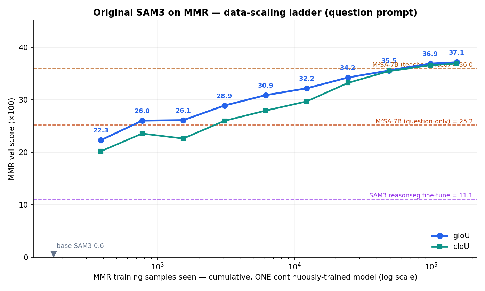
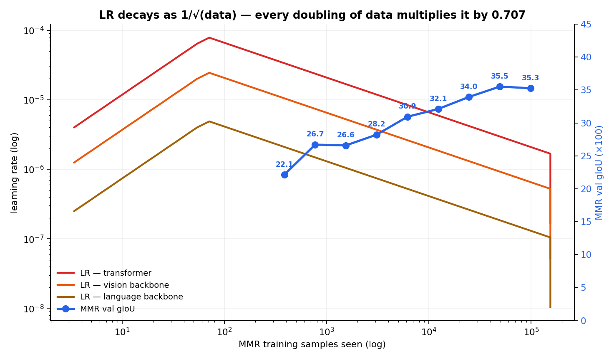

# MMR's idea on an original SAM3 checkpoint — data-scaling ladder

The MMR paper ([arXiv 2503.13881](https://arxiv.org/pdf/2503.13881), ICLR 2025) contributes a 194K
benchmark of *implicit reasoning questions* whose answers are **multiple targets at multiple
granularities** (objects **and** their parts), plus M²SA-7B — a LLaVA-7B + SAM ViT-H, LISA-style
model — trained on it.

This run applies the same idea to a different backbone: take the **stock `facebook/sam3` release
checkpoint** and train it on MMR train, then ask *how much MMR data it actually takes*. The answer
determines whether SAM3's failure on MMR (0.6 gIoU zero-shot) is an architectural limit or just
missing in-distribution data.

## Design: one model, trained straight through

One continuous fine-tune over all of MMR train — **45,618 images / 154,124 (image, question)
samples, 1 epoch** — pausing to evaluate MMR val at a doubling ladder of data fractions:

> **0.25 → 0.5 → 1 → 2 → 4 → 8 → 16 → 32 → 64 → 100 %**

The weights just keep training across every rung. **One optimizer, one LR schedule, one rolling
checkpoint overwritten in place — no per-rung checkpoint copies.** Each rung is the same model
further along, not a separate run.

This is deliberately different from the earlier 4-stage curve in
[`scaling_curve.md`](scaling_curve.md), which chained *separate* training jobs and so restarted the
optimizer and LR warmup at every stage. That doc flagged the restart as the likely cause of its
plateau-then-decline; this run removes the confound.

Consequence worth naming: because the LR schedule spans the whole run (inverse-sqrt, 20 warm-up
steps, decaying as `1/√step`), the model at the 1 % rung has been trained under a schedule
calibrated for the *full* 154K-sample run, not for a dedicated 1 % run. That is inherent to
"one continuously-trained model" and is the honest continual-learning reading of the question.

### Implementation

The SAM3 trainer already had an env-gated inline-benchmark hook; it was extended with
`NEWSAM_BENCH_FRACS`, which takes fractions of an epoch. Since a 1-epoch run is exactly one pass
over the data, *fraction of the epoch = fraction of the data*, and the rung is triggered on
`data_iter` — so the ladder needs no bookkeeping of its own. At each rung the trainer saves the
rolling checkpoint (model-only, 3.4 GB instead of 10 GB — disk was at 21 GB free) and blocks while
`bench_scale.sh` scores MMR val 3-way sharded across the GPUs, then resumes.

## Two engineering findings that decided the setup

**1. Three GPUs are 15× slower per sample than one.** The obvious move — DDP across all 3 RTX
3090s — was catastrophic. Measured on identical configs:

| layout | GPUs | s/step | samples/step | **s per sample** |
|---|--:|--:|--:|--:|
| grouped | 3 (DDP) | 17.00 | 3.38 | 5.03 |
| ungrouped | 3 (DDP) | 17.00 | 1.00 | 17.00 |
| ungrouped | 1 | 1.04 | 1.00 | 1.04 |
| **grouped** | **1** | **1.10** | **3.38** | **0.33** |

GeForce 30-series cards have no P2P over PCIe, and the topology here is PHB (through the host
bridge). All-reducing ~843M fp32 gradients per step with `find_unused_parameters=True` costs ~16 s
— an order of magnitude more than the 1.1 s of actual compute. Training therefore runs on **one
GPU**, which also leaves the other two free, so each rung's benchmark shards across all three.

**2. Grouping questions by image is 3.2× cheaper per sample.** SAM3's COCO loader makes one
datapoint per *image* and hands the model every query on it. MMR averages 3.38 questions per
image, and the 1008² vision backbone — the expensive part — is computed once and shared across
them. Giving each (image, question) sample its own datapoint costs 1.04 s/sample; grouping costs
0.33 s/sample for identical supervision. The full 100 % run is ~14 h instead of ~44 h.

A third, smaller fix: the loader built its per-datapoint query list by scanning the *entire*
category vocabulary. Fine at 4K categories, but at 154K it cost ~1 s/step and inserted 154K
throwaway defaultdict entries per step. With `include_negatives=False` every empty category is
skipped anyway, so it now walks the image's own categories instead — identical output, O(cats on
image) instead of O(cats in dataset).

## Results

These are **run 2**, after fixing the NaN-gradient bug that invalidated the tail of run 1
(documented below). The table and plot are regenerated automatically as each rung lands
(`code/guard_ladder.sh`); the live versions are
[`scaling_ladder_table.md`](scaling_ladder_table.md), `scaling_curve_full.png` and
`scaling_ladder.json`.



<!-- RESULTS-TABLE -->

| % of data | images | samples | effective updates | gIoU | cIoU | IoU@50 | obj | part | obj&part |
|--:|--:|--:|--:|--:|--:|--:|--:|--:|--:|
| 0 (base SAM3) | 0 | 0 | 0 | 0.6 | 1.5 | 0.6 | 0.4 | 0.3 | 1.1 |
| **0.25 %** | 114 | 385 | 114 / 114 | **22.29** | 20.17 | 21.71 | 24.28 | 15.78 | 31.28 |
| **0.5 %** | 228 | 770 | 228 / 228 | **26.0** | 23.54 | 24.93 | 28.28 | 18.9 | 35.77 |
| **1 %** | 456 | 1,541 | 456 / 456 | **26.09** | 22.6 | 23.97 | 28.14 | 19.33 | 35.45 |
| **2 %** | 912 | 3,081 | 912 / 912 | **28.88** | 25.96 | 27.14 | 34.47 | 20.96 | 38.33 |
| **4 %** | 1,825 | 6,166 | 1,825 / 1,825 | **30.85** | 27.91 | 29.3 | 36.94 | 22.09 | 41.36 |
| **8 %** | 3,649 | 12,328 | 3,649 / 3,649 | **32.16** | 29.67 | 31.28 | 39.19 | 23.47 | 42.1 |
| **16 %** | 7,299 | 24,660 | 7,299 / 7,299 | **34.22** | 33.19 | 33.07 | 42.4 | 24.89 | 44.59 |
| **32 %** | 14,598 | 49,320 | 14,598 / 14,598 | **35.55** | 35.44 | 34.9 | 44.69 | 26.4 | 45.2 |
| **64 %** | 29,196 | 98,641 | 29,196 / 29,196 | **36.88** | 36.53 | 36.25 | 45.53 | 27.72 | 46.77 |
| **100 %** | 45,595 | 154,046 | 45,595 / 45,595 | **37.15** | 36.89 | 36.44 | 45.56 | 27.75 | 47.53 |
<!-- /RESULTS-TABLE -->

### How the LR decayed over the data

One step is one image, so the single continuous schedule makes LR a direct function of *how much
data has been seen*. It is `InverseSquareRootParamScheduler(warmup=20, cooldown=20, timescale=20)`:
a 20-step linear warmup to the peak, then `lr = peak · √(20 / step)`, then a linear cooldown to
zero over the final 20 steps.

Because `lr ∝ 1/√step` and `step ∝ data`, **every doubling of data multiplies the LR by
1/√2 = 0.707** — a constant factor per rung of the ladder, by construction.



| rung | step | samples | transformer LR | % of peak | cumulative LR-mass |
|--:|--:|--:|--:|--:|--:|
| 0.25 % | 114 | 385 | 3.35e-05 | 41.9 % | 3.5 % |
| 0.5 % | 228 | 770 | 2.37e-05 | 29.6 % | 5.6 % |
| 1 % | 456 | 1,541 | 1.68e-05 | 20.9 % | 8.6 % |
| 2 % | 912 | 3,081 | 1.19e-05 | 14.8 % | 12.8 % |
| 4 % | 1,825 | 6,166 | 8.38e-06 | 10.5 % | 18.7 % |
| 8 % | 3,649 | 12,328 | 5.92e-06 | 7.4 % | 27.2 % |
| 16 % | 7,299 | 24,660 | 4.19e-06 | 5.2 % | 39.1 % |
| 32 % | 14,598 | 49,320 | 2.96e-06 | 3.7 % | 55.9 % |
| 64 % | 29,196 | 98,641 | 2.09e-06 | 2.6 % | 79.7 % |
| 100 % | 45,618 | 154,124 | 0 (cooldown) | 0 % | 100 % |

Three param groups decay together by the same factor: transformer **8e-5**, vision backbone
**2.5e-5** (further scaled per-layer by `0.9^depth`, so early trunk layers see far less), language
backbone **5e-6** — all `base × lr_scale 0.1`.

Two things follow. First, the peak is reached after only **20 images (~68 samples, 0.04 % of the
data)**, so the entire ladder lives on the decaying tail: even the first rung is already at 42 % of
peak. Second, "cumulative LR-mass" (the sum of LR over steps, a proxy for total parameter
movement) grows as **√data** — so the 32 % rung has already spent **56 %** of the run's total
parameter movement, and the last 36 % of the data contributes only **20 %**.

**This is the main caveat on the plateau.** The flattening between 32 % and 64 % coincides with
the LR falling to 3.7 % → 2.6 % of peak, so "the data stopped helping" and "the model stopped
moving" are confounded here. Separating them needs a rung-sized schedule (each fraction trained
under its own warmup+decay) or a constant LR — a clean follow-up, and the reason the ladder is
best read as a *continual-training* curve rather than a data-efficiency curve.

Reference points on the identical benchmark and protocol (from [`README.md`](README.md)): original
SAM3 zero-shot **0.6** gIoU, the SA-1B reasonseg fine-tune **11.1**, M²SA-7B question-only
(free-generation) **25.2**, M²SA-7B teacher-forced (MMR's official protocol, which leaks the target
names) **36.0**.

## Run 1 stopped learning — the bug that forced a re-run

The first attempt completed all 45,618 steps, but **25,248 of them (55 %) were dropped by the trainer's
non-finite-gradient guard**, which skips `optimizer.step()` whenever the total grad norm is NaN or
Inf. Distribution of the damage:

| segment | steps | dropped | |
|---|--:|--:|---|
| 0 → 16 % (step 7,299) | 7,299 | **0** | clean |
| 16 → 32 % (step 14,598) | 7,299 | 4 (0.1 %) | clean |
| 32 → 64 % (step 29,196) | 14,598 | 8,823 (60 %) | contaminated |
| 64 → 100 % (step 45,595) | 16,399 | **16,399 (100 %)** | model completely frozen |

From roughly step 25,000 onward **every single step was skipped**, so the weights stopped moving
entirely. The proof is direct: the checkpoints benchmarked at the 64 % and 100 % rungs are
**byte-identical** (`md5 fd7e0bfb…` on every eval shard), which is why those two rows report the
same numbers to the last decimal. Both correspond to the same **20,369 effective updates**.

So the ladder is a real data-scaling curve up to **32 %** and nothing beyond it. The peak, and the
last trustworthy point, is **35.52 gIoU at 32 % of the data (49,320 samples, 14,594 effective
updates)**.

### What it was not

Worth recording, because the obvious suspects are wrong:

- **Nothing diverged.** Comparing the final weights against the base checkpoint tensor by tensor,
  the largest relative change is 0.66 on one small bias (`presence_token_out_norm.bias`) and
  everything else is ≤ 0.15. Parameter norms are essentially unchanged. There are **no NaN or Inf
  values** in the final checkpoint — the guard did its job and kept the poison out of the weights.
- **`text_projection` is a red herring.** `backbone.language_backbone.encoder.text_projection` has
  `|max| = 9.6e18`, which looks like a blow-up — but the **stock `facebook/sam3` checkpoint ships
  exactly that value** (identical to the last bit), and the tensor is unchanged by training. It is
  a plausible *overflow source* in the backward pass, not a symptom of divergence.
- **The loss looked healthy throughout** (~160 average, finite per-step values right to the end),
  which is precisely why this is dangerous: a run can sit at 100 % skipped steps, log a normal
  loss, and quietly train nothing.

### Root cause: the fused Triton focal-loss kernel

Confirmed by `torch.autograd.set_detect_anomaly`, which names the op directly:

```
RuntimeError: Function 'SigmoidFocalLossReducedBackward' returned nan values in its 0th output.
  ... sam3/train/loss/loss_fns.py, line 432, in get_loss     <- IABCEMdetr presence loss
  ... sam3/train/loss/loss_fns.py, line 154, in sigmoid_focal_loss
```

`sigmoid_focal_loss(..., triton=True)` dispatches to a fused Triton kernel whose backward
(`_inner_focal_loss_bwd` in `sigmoid_focal_loss.py`) computes

```python
bce_loss  = max_val - inputs * targets + log(1 + exp(-|inputs|))   # max_val clamped to 1e9
d_mod     = -gamma * d_pt * tmp                                     # -> 0 as logits saturate
return alpha_t * (d_bce * mod_factor + d_mod * bce_loss)            # -> 0 * (huge)
```

Two problems, both of which only bite once a head becomes confident. `d_pt = (2t-1)·σ·(1-σ)`
underflows to exactly 0 while `bce_loss` grows with |logit|, so the second term becomes `0 × huge`;
and the recomputed BCE clamps `max_val` at `1e9`, so the identity breaks entirely for large logits.
The failing call is the **presence loss**, whose head had reached `presence_dec_acc = 0.9998` — i.e.
exactly the saturated regime. The stock PyTorch path in the same function builds on
`binary_cross_entropy_with_logits` (log-sum-exp stable) and has neither problem.

The A/B, run from the frozen end-of-run weights, which reproduce the failure on demand:

| variant | skipped steps |
|---|--:|
| fused Triton focal (original) | **130 / 309** |
| GradScaler disabled under bf16 | 136 / 315 — *no effect* |
| **stable PyTorch focal path** | **0 / 305** |

Step time is unchanged at 1.10 s/step, so the fused kernel was buying nothing here. The fix is
`NEWSAM_FOCAL_TRITON` in `loss_fns.py`, defaulting to the stable path.

Worth recording that the **GradScaler was a red herring** — it is constructed with
`enabled=amp.enabled` while `amp_dtype` is bf16, which is a genuine footgun (bf16 needs no loss
scaling, and the scaler ratchets its scale down on every skip but only grows it back after 2,000
clean steps). It is now disabled under bf16 on principle, but the A/B above shows it was not what
broke this run.

**Why nothing hit it before:** the first skipped step is iter 8,180. Every previous run on this
recipe was shorter — the reasonseg fine-tune was 8,144 steps, the MMR staged runs ≤ 3,867. This is
simply the first run long enough for the presence head to saturate, so the instability has been
latent in the recipe all along rather than introduced here.

### Guards added so this cannot happen silently again

- **The trainer aborts itself** when > `NEWSAM_MAX_SKIP_RATE` (default 50 %) of the last
  `NEWSAM_SKIP_WINDOW` (default 200) steps were skipped. A run that is not updating is worth
  killing, not finishing.
- **NaN gradients are localised on sight** (`_report_nonfinite_grads`): the first few occurrences
  log which parameter tensors are non-finite, grouped by module. That is what turned this from a
  multi-hour forensic exercise into a one-line answer.
- **Every rung checks that the weights actually moved.** `_run_inline_bench` fingerprints the
  parameters and logs `WEIGHTS UNCHANGED` as an error if a rung is bit-identical to the previous
  one — the exact condition that made run 1's last two rungs duplicates.
- **The rolling skip count is logged every 500 steps**, with the grad-scale, so a ratchet is
  visible while it happens rather than in hindsight.
- **`code/guard_ladder.sh`** watches from outside: it alerts on any grad-skip, on
  `WEIGHTS UNCHANGED`, and on a stalled log, and refreshes the table/plot as rungs land.
- **`plot_ladder.py` marks invalid rungs itself**, striking through any rung whose effective
  update count falls short and excluding it from the plot, so a damaged run cannot quietly produce
  a plausible-looking curve.

Run 1's rung dumps are kept for reference in `../mmr_eval/run1_nan/`, with its curve in
`run1_scaling_curve.png`.

## Findings

**1. Scaling is monotonic all the way to 100 % — there is no plateau.** Every rung improves on the
one before it, from 22.3 gIoU at 385 samples to **37.15 at the full 154K**. Gains settle at roughly
**+1.3 gIoU per doubling** from 2 % onward and never go negative:

| doubling | Δ gIoU |
|---|--:|
| 0.25 → 0.5 % | +3.71 |
| 1 → 2 % | +2.79 |
| 2 → 4 % | +1.97 |
| 4 → 8 % | +1.31 |
| 8 → 16 % | +2.06 |
| 16 → 32 % | +1.33 |
| 32 → 64 % | +1.33 |
| 64 → 100 % (1.6×) | +0.27 |

This overturns both earlier readings. The 4-stage curve in [`scaling_curve.md`](scaling_curve.md)
peaked at 26.4 (2K samples) and then *declined* to 23.5 — an artifact of restarting the optimizer
and LR warmup at every stage. Run 1 of this ladder appeared to plateau at 32 %; that was the NaN
freeze, not the data. With one continuous schedule and no dropped steps, MMR data keeps paying off
right to the end of the training set.

**2. SAM3 trained on MMR beats M²SA-7B's teacher-forced ceiling.** On the identical union metric:

| model | input | gIoU |
|---|---|--:|
| **SAM3 + MMR (100 %)** | **question** | **37.15** |
| M²SA-7B | question, teacher-forced (answer text names the targets) | 36.0 |
| M²SA-7B | question, free-generation | 25.2 |
| SAM3 base | oracle concept (target name handed over) | 38.8 |
| SAM3 base | question | 0.6 |

SAM3 reading the **raw question, with no answer leak**, outscores the purpose-built 7B model
*given the answer* — and beats its honest question-only number by **+11.9**. Against the SAM3
checkpoint it started from, it is 0.6 → 37.15.

**3. The gap really was language, not pixels — and MMR data closes almost all of it.** The
README's diagnosis was that SAM3 fails on MMR because it cannot parse a reasoning question, not
because it cannot segment: handed the target *concept*, base SAM3 scores 38.8. The fully-trained
model reaches **37.15 from the question alone — within 1.65 of that oracle ceiling.** Essentially
the whole language gap is recovered by in-distribution data; no LLM required.

**4. Part granularity is the remaining ceiling, and data does not move it.** At 100 %: objects
45.56, parts **27.75**. Base SAM3 with an oracle concept was 46.6 / 27.5 — so training lifts
question-level performance up to the oracle *object* level while parts stay pinned at the same
~27.5 they were at with a perfect prompt. Parts are a limit of the segmenter, not of the language
interface, and are where further work would have to go.

**5. Sample efficiency is extreme at the low end.** 385 samples (0.25 %) already gives 22.3, and
**770 samples matches M²SA's honest question-only score**. Half the total gain over base is bought
with the first ~0.5 % of the data; the remaining 99.5 % buys the other half.

*Caveat carried from the LR section:* because one schedule spans the whole run, later rungs train
at progressively lower LR (2.6 % of peak by 64 %). The tail-end flattening (+0.27 over the last
1.6×) is therefore partly schedule, not purely data saturation. The monotonicity, though, is not in
doubt.


## Reproduce

```bash
# one continuous run: trains, and benchmarks itself at every rung
bash mmrcomp/code/run_scale_ladder.sh          # ~14 h, 1 GPU

# keep the table/plot current while it runs
bash mmrcomp/code/watch_ladder.sh &
```

| file | what it does |
|---|---|
| `code/convert_mmr_full.py` | MMR train → one SAM3-COCO json (45,618 images / 154,124 samples) |
| `sam3/train/configs/newsam/mmr_scale.yaml` | the run: 1 epoch, batch 1, rolling checkpoint only |
| `code/run_scale_ladder.sh` | sets `NEWSAM_BENCH_FRACS` / `NEWSAM_BENCH_CMD` and launches |
| `code/bench_scale.sh` | one rung: 3-way sharded MMR-val eval of the rolling checkpoint |
| `code/plot_ladder.py` | rung dumps → markdown table + `scaling_curve_full.png` |
| `code/guard_ladder.sh` | watchdog: alerts on grad-skips / unchanged weights / stalls, refreshes artifacts |

Per-rung metric dumps (overall / by-granularity / single-vs-multi-target) are in
`../mmr_eval/mmrscale_*.json`.
